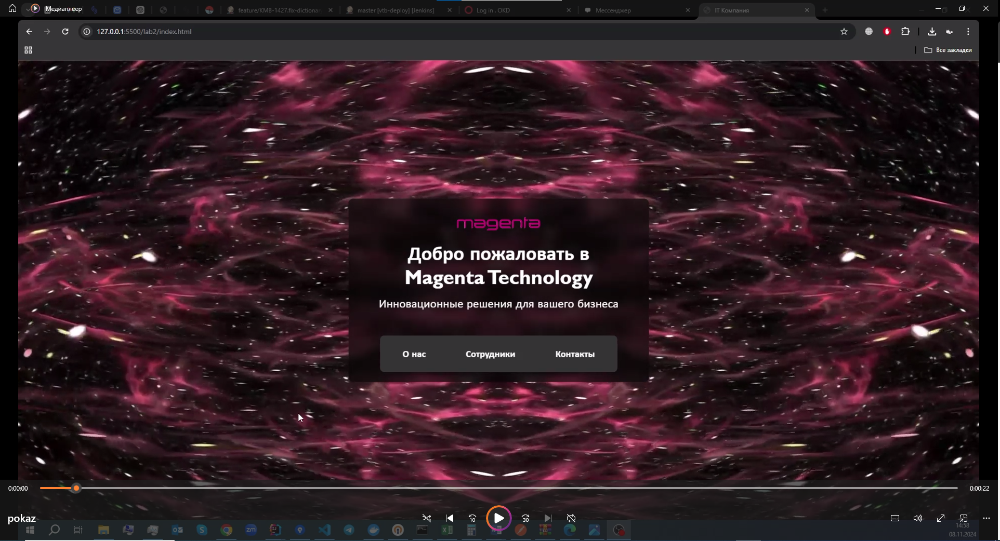

# Лабораторная №2

### Цель лабораторной работы:

Изучение основ HTML и CSS.
### Задание на программирование: 

Разработать многостраничный web-сайт на произвольно выбранную тему с использованием технологий HTML и CSS, загрузить проект в репозиторий.

### Требования к web-сайту:
1.	Количество страниц – от 3 до 5.
2.	Требования к HTML:
    - Использование блочных и строчных элементов.
    - Ссылки – от 1 шт.
    - Картинки – от 1 шт.
    - Таблица – от 1 шт.
3.	Требование к CSS:
    - Отдельный подключаемый файл.
    - Обязательное использование как минимум 3 видов селекторов.
    - Использование цвета.
    - Использование различных видов выравнивания в таблице (по левому/правому краю и по центру).
4.	Запрещено использовать JS, Bootstrap и любые другие библиотеки и фреймворки, всё реализовать самостоятельно

## Реализация проекта

### 1. Количество страниц

Проект включает 4 страницы, как требуется:
   - Главная страница
   - О нас
   - Сотрудники
   - Контакты

### 2. Требования к HTML

- **Блочные и строчные элементы**: 
   В проекте использованы блочные элементы (`
`, `<header>`, `<footer>`, `
`, `<h1>`, `<main>`, `<section>`) и строчные элементы (`<a>`, ``, ``) и т.д.

- **Ссылки**: 
   Навигационное меню содержит ссылки для перехода между страницами, а также есть внешние ссылки.

- **Картинки**: 
   На страницах "О нас" и "Сотрудники" добавлены изображения для галереи или профилей сотрудников.

- **Таблица**: 
   На странице "Контакты" представлена таблица с контактной информацией, в которой используется различное выравнивание текста (по левому, правому краю и по центру).

### 3. Требования к CSS

- **Подключаемый CSS-файл**: 
   В проекте используются отдельные CSS-файлы для каждой страницы.

- **Использование различных селекторов**: 
   В CSS-файлах использованы различные типы селекторов:
   - **Классовые селекторы** (например, `.employees-grid`, `.employee-card` для карточек сотрудников).
   - **Идентификаторы** (например, `#main-content` для основного содержимого страницы).
   - **Теговые селекторы** (например, `body`, `h1`, `p` для базовых стилей текста).
   
- **Использование цвета**: 
   Реализованы цвета фона, текста, кнопок и эффектов наведения.

- **Выравнивание в таблице**: 
   В таблице на странице "Контакты" ячейки имеют различное выравнивание текста (по левому, правому краю и по центру).

### 4. Запрещено использование JS, Bootstrap и других библиотек
   Проект выполнен без использования JavaScript, Bootstrap и других библиотек. Все стили и элементы реализованы исключительно на HTML и CSS, как указано в требованиях.

## Демонстрационное видео

