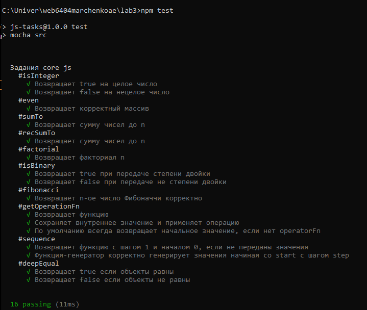

# Web-программирование
----
### Немножко интересного обо мне:

**ФИО** > Марченко Екатерина Александровна

**Группа** > 6404-010302D

**Научный руководитель** > Федосеев Виктор Андреевич, доцент кафедры геоинформатики и информационной безопасности

**Тема диплома** > Создание модуля поведенческого анализа для DLP-системы с использованием нейросетевых технологий

**Любимая цитата** 
> "5 символов в час - именно так джунишка Екатерина пытается справиться с апишкой /helloWorld" 

c. мой коллега Александр

---

# Лабораторная №2

### Цель лабораторной работы:

Изучение основ HTML и CSS.
### Задание на программирование: 

Разработать многостраничный web-сайт на произвольно выбранную тему с использованием технологий HTML и CSS, загрузить проект в репозиторий.

### Требования к web-сайту:
1.	Количество страниц – от 3 до 5.
2.	Требования к HTML:
    - Использование блочных и строчных элементов.
    - Ссылки – от 1 шт.
    - Картинки – от 1 шт.
    - Таблица – от 1 шт.
3.	Требование к CSS:
    - Отдельный подключаемый файл.
    - Обязательное использование как минимум 3 видов селекторов.
    - Использование цвета.
    - Использование различных видов выравнивания в таблице (по левому/правому краю и по центру).
4.	Запрещено использовать JS, Bootstrap и любые другие библиотеки и фреймворки, всё реализовать самостоятельно

## Реализация проекта

**Проект создан в ветке `lab2`**

### 1. Количество страниц

Проект включает 4 страницы, как требуется:
   - Главная страница
   - О нас
   - Сотрудники
   - Контакты

### 2. Требования к HTML

- **Блочные и строчные элементы**: 
   В проекте использованы блочные элементы (`
`, `<header>`, `<footer>`, `
`, `<h1>`, `<main>`, `<section>`) и строчные элементы (`<a>`, ``, ``) и т.д.

- **Ссылки**: 
   Навигационное меню содержит ссылки для перехода между страницами, а также есть внешние ссылки.

- **Картинки**: 
   На страницах "О нас" и "Сотрудники" добавлены изображения для галереи или профилей сотрудников.

- **Таблица**: 
   На странице "Контакты" представлена таблица с контактной информацией, в которой используется различное выравнивание текста (по левому, правому краю и по центру).

### 3. Требования к CSS

- **Подключаемый CSS-файл**: 
   В проекте используются отдельные CSS-файлы для каждой страницы.

- **Использование различных селекторов**: 
   В CSS-файлах использованы различные типы селекторов:
   - **Классовые селекторы** (например, `.employees-grid`, `.employee-card` для карточек сотрудников).
   - **Идентификаторы** (например, `#main-content` для основного содержимого страницы).
   - **Теговые селекторы** (например, `body`, `h1`, `p` для базовых стилей текста).
   
- **Использование цвета**: 
   Реализованы цвета фона, текста, кнопок и эффектов наведения.

- **Выравнивание в таблице**: 
   В таблице на странице "Контакты" ячейки имеют различное выравнивание текста (по левому, правому краю и по центру).

### 4. Запрещено использование JS, Bootstrap и других библиотек
   Проект выполнен без использования JavaScript, Bootstrap и других библиотек. Все стили и элементы реализованы исключительно на HTML и CSS, как указано в требованиях.

## Демонстрационное видео

Пожалуйста нажмите на превью:

# Лабораторная №3

### Цель лабораторной работы
Изучение основ JavaScript.

### Задание на программирование
Написать набор функций на языке JavaScript, реализующих требуемый функционал, и загрузить проект в репозиторий.

#### Ссылка на каркас проекта
[https://github.com/teach-kirshdv/js-tasks](https://github.com/teach-kirshdv/js-tasks)

### Порядок выполнения работы
1. Создать отдельную ветку `lab3` в репозитории для лабораторных работ.
2. Дополнить файл `Readme.md` описанием лабораторной работы №3.
3. Создать папку `lab3`.
4. Загрузить в папку `lab3` каркас проекта.
5. Реализовать проект в соответствии с заданием.

## Реализация проекта

**Проект создан в ветке `lab3`**

### 1 `isInteger`

**Описание**:  
Проверяет, является ли число целым, используя побитовые операторы.

**Аргументы**:  
- `number` (number): Число для проверки.

**Возвращаемое значение**:  
- `boolean`: `true`, если число целое; иначе `false`.

**Реализация**:  
Функция использует побитовый оператор `>>` для приведения числа к целому и проверяет, равно ли это преобразование исходному числу.

---

### 2 `even`

**Описание**:  
Возвращает массив четных чисел от 2 до 20 включительно.

**Аргументы**:  
- Нет.

**Возвращаемое значение**:  
- `number[]`: Массив четных чисел от 2 до 20.

**Реализация**:  
Создается массив `evenNumbers`, куда добавляются четные числа в цикле с шагом `2`, начиная с `2` до `20`.

---

### 3 `sumTo`

**Описание**:  
Считает сумму всех чисел от `1` до указанного числа с использованием формулы суммы арифметической прогрессии.

**Аргументы**:  
- `number` (number): Число, до которого нужно посчитать сумму.

**Возвращаемое значение**:  
- `number`: Сумма чисел от `1` до `number`.

**Реализация**:  
Используется формула `(number * (number + 1)) / 2` для расчета суммы чисел от `1` до `number`. Если `number` отрицательное, возвращается `null`.

---

### 4 `recSumTo`

**Описание**:  
Считает сумму чисел от `1` до заданного числа рекурсивно.

**Аргументы**:  
- `number` (number): Число, до которого нужно посчитать сумму.
- `accumulator` (number, по умолчанию `0`): Промежуточная сумма (используется для рекурсии).

**Возвращаемое значение**:  
- `number`: Сумма чисел от `1` до `number`.

**Реализация**:  
Использует рекурсию с аккумулятором. Функция вызывает себя, уменьшая `number` и добавляя его к `accumulator`. Возвращает `null`, если `number` отрицательное.

---

### 5 `factorial`

**Описание**:  
Считает факториал заданного числа с использованием рекурсии.

**Аргументы**:  
- `n` (number): Число, для которого нужно посчитать факториал.
- `accumulator` (number, по умолчанию `1`): Промежуточный результат (используется для рекурсии).

**Возвращаемое значение**:  
- `number`: Факториал числа `n`.

**Реализация**:  
Использует рекурсивное умножение с аккумулятором. При каждом вызове умножает `accumulator` на текущее значение `n` и вызывает себя с `n - 1`. Если `n` меньше нуля, возвращает `null`.

---

### 6 `isBinary`

**Описание**:  
Проверяет, является ли число степенью двойки, используя побитовые операторы.

**Аргументы**:  
- `number` (number): Число для проверки.

**Возвращаемое значение**:  
- `boolean`: `true`, если число является степенью двойки; иначе `false`.

**Реализация**:  
Использует побитовое выражение `(number & (number - 1)) === 0` для проверки, является ли `number` степенью двойки.

---

### 7 `fibonacci`

**Описание**:  
Находит `N`-е число Фибоначчи с вычислительной сложностью `O(log N)` с помощью матричного возведения в степень.

**Аргументы**:  
- `number` (number): Индекс числа Фибоначчи.

**Возвращаемое значение**:  
- `number`: `N`-е число Фибоначчи.

**Реализация**:  
Использует матричное возведение в степень для вычисления числа Фибоначчи. Инициализирует две матрицы `resultFib` и `matrix_for_fib`, затем использует цикл для их перемножения и возведения в степень.

---

### 8 `getOperationFn`

**Описание**:  
Создает функцию, выполняющую заданную операцию над двумя числами, начиная с начального значения. Если операция не указана, возвращает начальное значение.

**Аргументы**:  
- `initialValue` (number): Начальное значение.
- `operatorFn` (function): Функция операции, принимающая два числа.

**Возвращаемое значение**:  
- `function`: Функция-генератор, которая выполняет указанную операцию.

**Реализация**:  
Возвращает функцию, которая хранит текущее значение и при каждом вызове обновляет его, выполняя `operatorFn` с текущим и новым значением.

---

### 9 `sequence`

**Описание**:  
Создает генератор арифметической последовательности. При каждом вызове возвращает следующий элемент последовательности.

**Аргументы**:  
- `start` (number, по умолчанию `0`): Начальное значение последовательности.
- `step` (number, по умолчанию `1`): Шаг последовательности.

**Возвращаемое значение**:  
- `function`: Функция-генератор последовательности.

**Реализация**:  
Использует замыкание для хранения текущего значения последовательности, добавляя `step` к значению при каждом вызове.

---

### 10 `deepEqual`

**Описание**:  
Проверяет, равны ли два значения, включая специфичные объекты (`Date`, `RegExp`, `Map`, `Set`). Выполняет глубокое сравнение вложенных структур.

**Аргументы**:  
- `firstObject` (object): Первый объект для сравнения.
- `secondObject` (object): Второй объект для сравнения.

**Возвращаемое значение**:  
- `boolean`: `true`, если объекты равны по содержимому; иначе `false`.

**Реализация**:  
Использует рекурсивное сравнение. Проверяет `Date` по времени, `RegExp` по строковому представлению, `Map` и `Set` по ключам и значениям, а массивы и обычные объекты по ключам и значению каждого элемента.

## Все тесты успешно пройдены

# Лабораторная работа № 4

## Задание на лабораторную работу

**Цель лабораторной работы:** изучение современного CSS, обработки событий на JavaScript и асинхронности.

**Задание на программирование:** модернизировать web-сайт из лабораторной работы №2 с использованием технологий HTML, CSS и JavaScript, и загрузить проект в репозиторий.

### Требования к web-сайту:

1. Вёрстка с помощью **Flexbox** — 1 страница. 

На странице "Проекты" реализована вёрстка только с использованием Flexbox.

2. Вёрстка с помощью **Grid** — 1 страница.  

На странице "Контакты" реализована вёрстка только с использованием Grid.

3. Реализация **анимации** (красивой!) с помощью CSS — 1 шт. 

На странице "Проекты" реализована анимация с плавным появлением видео при наведении на карточку проекта.

4. Реализация **формы** с отправкой **POST-запроса** на сервер по нажатию кнопки (без обработки на серверной стороне). 

На странице "Резюме" реализована форма для отправки данных на сервер по методу POST.

5. Проверка введённых данных с использованием **событийной модели** JavaScript. 

Форма на странице "Резюме" проверяет ввод данных в режиме реального времени.

6. Реализация **асинхронного запроса** на сервер для получения данных (например, для заполнения одной из таблиц) с обязательной обработкой возможных ошибок.

На странице "Контакты" реализован асинхронный запрос на сервер для получения данных о контактах.

---

### Порядок выполнения работы:
0. Выполнить **слияние** предыдущих лабораторных в **master-ветку** (через pull-request).  
1. Создать отдельную ветку **lab4** в репозитории для лабораторных работ.  
2. Дополнить файл **Readme.md** описанием лабораторной №4.  
3. Создать папку **lab4**.  
4. Реализовать **web-сайт** в соответствии с заданием.  
5. Выполнить **слияние** в **master-ветку**.

Пожалуйста нажмите на превью:

