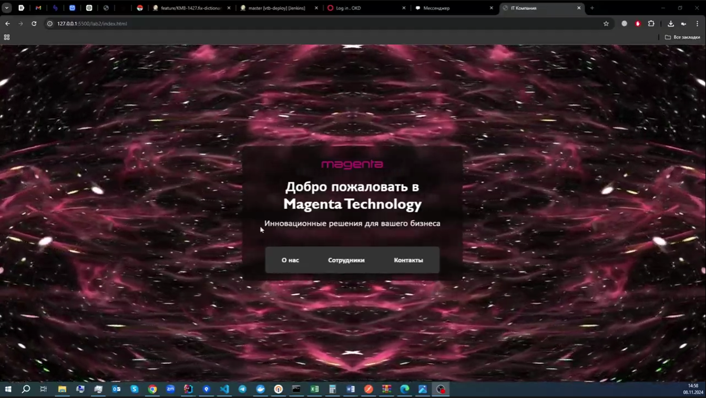

# Лабораторная №3

### Цель лабораторной работы
Изучение основ JavaScript.

### Задание на программирование
Написать набор функций на языке JavaScript, реализующих требуемый функционал, и загрузить проект в репозиторий.

#### Ссылка на каркас проекта
[https://github.com/teach-kirshdv/js-tasks](https://github.com/teach-kirshdv/js-tasks)

### Порядок выполнения работы
1. Создать отдельную ветку `lab3` в репозитории для лабораторных работ.
2. Дополнить файл `Readme.md` описанием лабораторной работы №3.
3. Создать папку `lab3`.
4. Загрузить в папку `lab3` каркас проекта.
5. Реализовать проект в соответствии с заданием.

## Реализация проекта

**Проект создан в ветке `lab3`**

### 1. Количество страниц

Проект включает 4 страницы, как требуется:
   - Главная страница
   - О нас
   - Сотрудники
   - Контакты

### 2. Требования к HTML

- **Блочные и строчные элементы**: 
   В проекте использованы блочные элементы (`
`, `<header>`, `<footer>`, `
`, `<h1>`, `<main>`, `<section>`) и строчные элементы (`<a>`, ``, ``) и т.д.

- **Ссылки**: 
   Навигационное меню содержит ссылки для перехода между страницами, а также есть внешние ссылки.

- **Картинки**: 
   На страницах "О нас" и "Сотрудники" добавлены изображения для галереи или профилей сотрудников.

- **Таблица**: 
   На странице "Контакты" представлена таблица с контактной информацией, в которой используется различное выравнивание текста (по левому, правому краю и по центру).

### 3. Требования к CSS

- **Подключаемый CSS-файл**: 
   В проекте используются отдельные CSS-файлы для каждой страницы.

- **Использование различных селекторов**: 
   В CSS-файлах использованы различные типы селекторов:
   - **Классовые селекторы** (например, `.employees-grid`, `.employee-card` для карточек сотрудников).
   - **Идентификаторы** (например, `#main-content` для основного содержимого страницы).
   - **Теговые селекторы** (например, `body`, `h1`, `p` для базовых стилей текста).
   
- **Использование цвета**: 
   Реализованы цвета фона, текста, кнопок и эффектов наведения.

- **Выравнивание в таблице**: 
   В таблице на странице "Контакты" ячейки имеют различное выравнивание текста (по левому, правому краю и по центру).

### 4. Запрещено использование JS, Bootstrap и других библиотек
   Проект выполнен без использования JavaScript, Bootstrap и других библиотек. Все стили и элементы реализованы исключительно на HTML и CSS, как указано в требованиях.

## Демонстрационное видео

Пожалуйста нажмите на превью:

